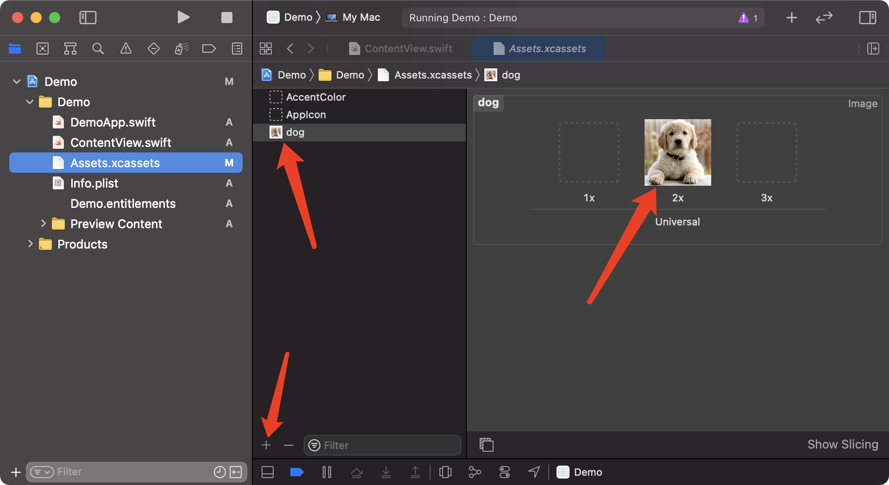

如何使用图像视图绘制图像？
===

使用图像视图在 `SwiftUI` 布局中呈现图像。 这些可以从您的包(bundle)，系统图标，`UIImage` 等加载图像，但是这三个是最常见的。

要从 `bundle` 中加载图片并将其显示在图片视图中，只需使用以下方法：

```swift
Image("dog")
```

需要在 `Assets.xcassets` 里面添加 `dog` 的图片。

<!--rehype:style=max-width:650px-->

如果要使用 `Apple` 的 `SF Symbols` 图标集，则应使用 `Image(systemName:)` 初始化程序，如下所示：

```swift
Image(systemName: "cloud.heavyrain.fill")
    .font(.largeTitle)
```

请注意，如何使用 `font()` 修饰符来调整 `SF Symbols`，就好像它们是文本一样。

异步加载网络图片

```swift
struct ContentView : View {
    @State private var remoteImage : UIImage? = nil
    let placeholderOne = UIImage(named: "Picture")
    
    var body: some View {
        Image(uiImage: self.remoteImage ?? placeholderOne!)
            .onAppear(perform: fetchRemoteImage)
    }
    
    func fetchRemoteImage()
    {
        guard let url = URL(string: "https://avatars.githubusercontent.com/u/1680273?v=4") else { return }
        URLSession.shared.dataTask(with: url){ (data, response, error) in
            if let image = UIImage(data: data!){
                self.remoteImage = image
            }
            else{
                print(error ?? "")
            }
        }.resume()
    }
}
```