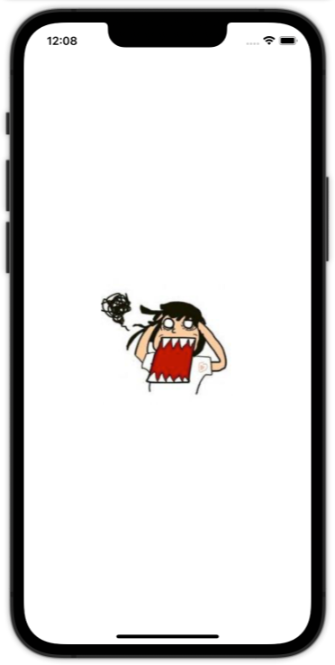
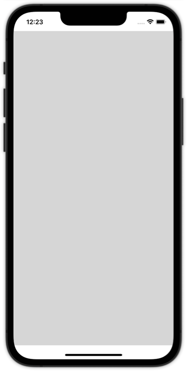
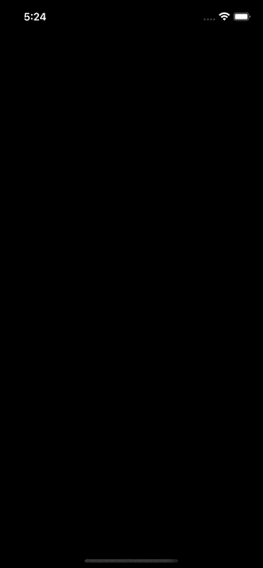

如何从 URL 加载远程图像？
===

SwiftUI 有一个专用的 [`AsyncImage`](https://developer.apple.com/documentation/swiftui/asyncimage) 用于从互联网下载和显示远程图像。 以最简单的形式，您可以只传递一个 URL，如下所示：

```swift
if #available(iOS 15.0, *) {
  AsyncImage(url: URL(string: "https://avatars.githubusercontent.com/u/1680273?v=4"))
} else {
  // Fallback on earlier versions
}
```

> 🚧  兼容性
> - iOS 15.0+
> - iPadOS 15.0+
> - macOS 12.0+ Beta
> - Mac Catalyst 15.0+ Beta
> - tvOS 15.0+
> - watchOS 8.0+
<!--rehype:style=border-left: 8px solid #ffe564;background-color: #ffe56440;padding: 12px 16px;-->

<!--rehype:style=max-width:320px-->

请注意 URL 是如何可选的——如果 URL 字符串无效，`AsyncImage` 将只显示一个默认的灰色占位符。 如果由于某种原因无法加载图像 —— 如果用户离线，或者图像不存在——那么系统将继续显示相同的占位符图像。

<!--rehype:style=max-width:320px-->

因为 `SwiftUI` 不知道下载的图像有多大，默认情况下 `AsyncImage` 在加载时具有灵活的宽度和高度。 因此，除非您另外指定，否则在加载图像时它会在您的 UI 中占用大量空间，然后在加载图像后立即跳转到正确的大小。

尽管您可以将框架附加到您的图像，但默认情况下它只会影响占位符 - 如果您完成的图像以不同的尺寸到达，您的 UI 将不得不进行调整以适应它。

更好的解决方案是添加函数来控制结果图像的显示方式以及您想要的占位符类型。 例如，这会获取我们的图像并使其可调整大小，但在加载时使用红色占位符颜色：

```swift
AsyncImage(url: URL(string: "https://jaywcjlove.github.io/swiftui-example/example/images-shapes-media/demo13/imgs/avatars.png")) { image in
  image.resizable()
    .aspectRatio(contentMode: .fit)
    .clipShape(RoundedRectangle(cornerRadius: 15))
    .padding()
} placeholder: {
    Color.red
}
.frame(width: 128, height: 128)
.clipShape(RoundedRectangle(cornerRadius: 25))
```

<!--rehype:style=max-width:320px-->

因为生成的图像和占位符颜色现在都可以调整大小，所以 `frame()` 修饰符能够确保我们的 `AsyncImage` 始终保持正确的大小。 在你问之前：不，`AsyncImage` 上没有直接可用的 `resizable()` 修饰符。

注意：默认情况下，假设图像的比例为 `1`，这意味着专为非视网膜屏幕设计。 但是，如果您已经知道正确的比例，您也可以使用第二个参数控制比例：

```swift
AsyncImage(url: URL(string: "https://jaywcjlove.github.io/swiftui-example/example/images-shapes-media/demo13/imgs/avatars@2x.png"), scale: 2)
```

## 图像加载过度效果

AsyncImage 有另一个初始化器，它允许分阶段获取图像加载结果：

```swift
public init(url: URL?, scale: CGFloat = 1, transaction: Transaction = Transaction(), @ViewBuilder content: @escaping (AsyncImagePhase) -> Content)
```

请参阅以下示例：

```swift
import SwiftUI

@ViewBuilder
func waitView() -> some View {
  VStack {
    if #available(iOS 15.0, *) {
      ProgressView()
        .progressViewStyle(CircularProgressViewStyle(tint: .indigo))
    } else {
      // Fallback on earlier versions
    }
    Text("Fetching image...")
  }
}

struct AvatarsView: View {
  var body: some View {
    if #available(iOS 15.0, *) {
      AsyncImage(
        url: URL(string: "https://avatars.githubusercontent.com/u/1680273?v=4"),
        transaction: Transaction(animation: .easeInOut(duration: 2.5))
      ) { phase in
        switch phase {
          case .success(let image):
            image
              .resizable()
              .aspectRatio(contentMode: .fit)
              .clipShape(RoundedRectangle(cornerRadius: 15))
              .padding()
  
          case .failure(let error):
            Text(error.localizedDescription)
    
          case .empty:
            waitView()
    
          @unknown default:
            EmptyView()
        }
      }
      .frame(width: 128, height: 128)

    } else {
      // Fallback on earlier versions
    }
  }
}
```

这里我只提供 `URL` 和 `content` 参数，这是一个闭包。 闭包的参数是一个 `AsyncImagePhase` 值，其中 `AsyncImagePhase` 是一个枚举，包含代表某些加载阶段的案例。

实际上，您可以在上方的 `switch` 语句中看到 `AsyncImagePhase` 的所有可用情况。 第一种是已经成功获取图像的情况。 `case` 的关联值是一个 `SwiftUI Image` 视图，我们可以使用任何必要的视图修饰符来装饰它。

第二种情况包含可能发生的潜在错误。 在这个例子中，我只是在文本视图中呈现错误描述。

最后一个名为 `.empty` 的情况表示当还没有加载图像时 `AsyncImage` 视图的状态。 在这里，我们可以添加占位符视图、进度视图或适合应用程序的任何其他内容。 在上面的示例中，我调用了 `waitView()` 方法，如下所示：

```swift
@ViewBuilder
func waitView() -> some View {
  VStack {
    if #available(iOS 15.0, *) {
      ProgressView()
        .progressViewStyle(CircularProgressViewStyle(tint: .indigo))
    } else {
      // Fallback on earlier versions
    }
    Text("Fetching image...")
  }
}
```

其目的是与文本一起呈现进度视图。

看到 `switch` 语句中还有一个 `@unknown default case;` 这是处理将来可能添加到 `AsyncImagePhase` 枚举的任何新值所必需的。 `EmptyView` 是处理这种情况的最佳候选者。

上面的 `AsyncImage` 实现结果如下：

<!--rehype:style=max-width:320px-->

通常，请注意上述初始化 `AsyncImage` 视图的方法可以更好地控制视图的结果。 特别是，我们实际上可以检测到此错误何时发生，从而显示不同的视图； 使用上一部分中遇到的占位符初始值设定项我们无法做到的事情。

但这并不是这个初始化程序的唯一好处。 通过 transaction 参数，我们可以传递一个动画，该动画将在阶段变化时启动。 接下来你可以看到和之前一样的例子，这次只为事务参数提供了一个动画实例：