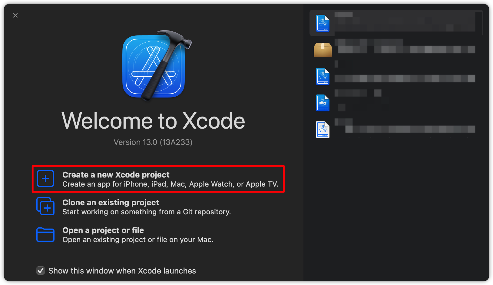
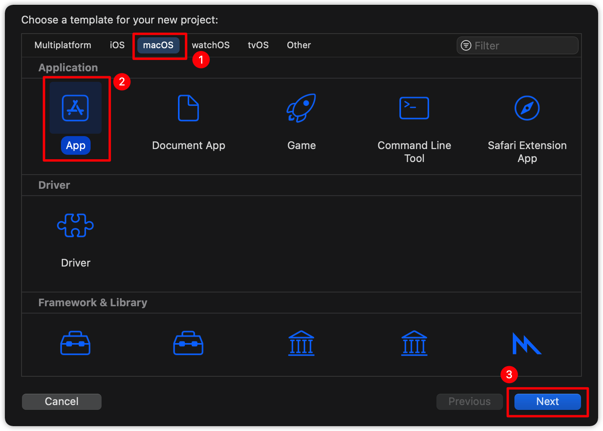
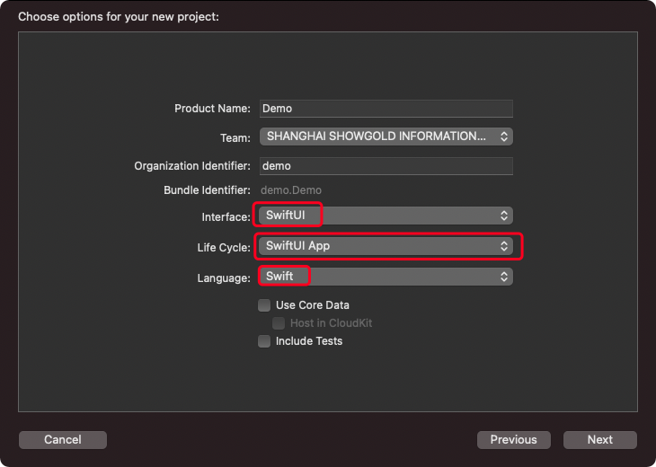
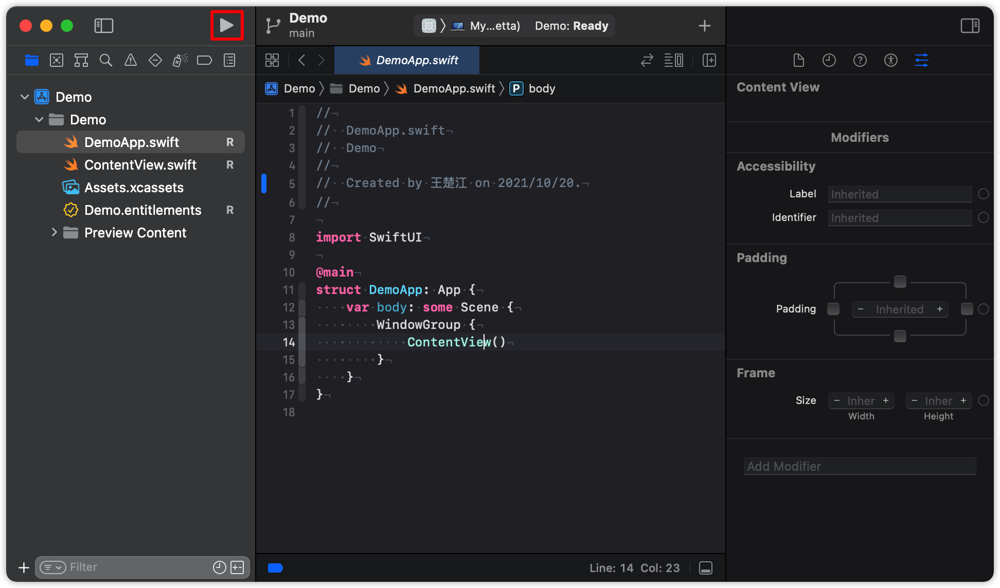

创建一个 `SwiftUI` 项目
===

首先，打开 `Xcode` 创建一下新的 `Xcode` 工程。

<!--rehype:style=max-width:650px-->

请在 `Xcode` 中创建一个名为 `Demo` 的新 `macOS` 项目，选择 `应用` 模板。

<!--rehype:style=max-width:650px-->

您还应该为界面选择 `SwiftUI` ，为生命周期选择 `SwiftUI` 应用。

<!--rehype:style=max-width:650px-->

现在你可以点击 <kbd>▶︎</kbd> 运行起来，也可以通过快捷键 <kbd>⌘</kbd> + <kbd>r</kbd>

<!--rehype:style=max-width:650px-->

- <kbd>⌘</kbd> + <kbd>b</kbd> 编译工程
- <kbd>⌘</kbd> + <kbd>⇧</kbd> + <kbd>k</kbd> 清除编译文件夹
- <kbd>⌘</kbd> + <kbd>.</kbd> 停止运行
