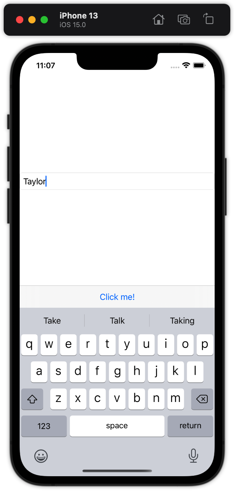
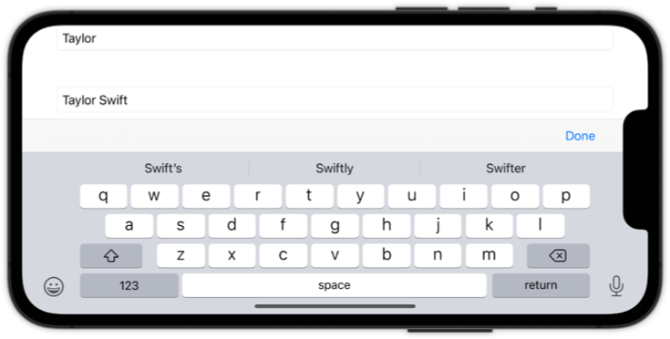

如何在键盘上添加工具栏？
===


`SwiftUI` 允许我们向键盘添加输入附件视图，这意味着当用户激活某些文本输入时，我们可以在那里显示自定义按钮。

这一切都是通过将 `toolbar()` 修饰符附加到应该拥有输入附件的任何视图来完成的。 创建工具栏项组时，使用 `.keyboard` 放置将此工具栏附加到键盘，如下所示：

```swift
@available(iOS 15.0, *)
struct ContentView: View {
  @State private var name = "Taylor"

  var body: some View {
    TextField("Enter your name", text: $name)
      .textFieldStyle(.roundedBorder)
      .toolbar {
        ToolbarItemGroup(placement: .keyboard) {
          Button("Click me!") {
              print("Clicked")
          }
        }
      }
  }
}
```

<!--rehype:style=max-width:320px-->

🚧  重要提示：在 `Xcode 13 beta 1` 中，这需要 `NavigationView` 才能工作。

实际上，这是使用 `@FocusState` 之类的东西在 `UI` 中的输入字段之间移动或完全隐藏键盘的好地方，如下所示：

```swift
@available(iOS 15.0, *)
struct ContentViewMore: View {
  @State private var name = "Taylor Swift"
  @FocusState var isInputActive: Bool

  var body: some View {
    NavigationView {
      TextField("Enter your name", text: $name)
        .textFieldStyle(.roundedBorder)
        .focused($isInputActive)
        .toolbar {
          ToolbarItemGroup(placement: .keyboard) {
              Spacer()

              Button("Done") {
                  isInputActive = false
              }
          }
        }
    }
  }
}
```

<!--rehype:style=max-width:680px-->