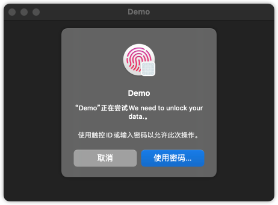

如何在 `SwiftUI` 中使用 `Touch ID` 和 `Face ID`?
---

苹果公司的绝大多数设备都标配有生物识别认证，这意味着它们使用指纹和面部识别来解锁。我们也可以使用此功能，这意味着我们可以确保仅当有效用户解锁后才能读取敏感数据。



在编写任何代码之前，您需要向 `Info.plist` 文件中添加一个新密钥，向用户说明为什么要访问 `Face ID`。由于只有 `Apple` 知道的原因，我们在代码中传递了 `Touch ID` 请求原因，而在 `Info.plist` 中传递了 `Face ID` 请求原因。

立即打开 `Info.plist`，右键单击一些空间，然后选择 `Add Row`。滚动键列表，直到找到 `Privacy - Face ID Usage Description`，并为其赋予值 `$(PRODUCT_NAME) need Touch Id or Face ID permission for app lock`。

```xml
<key>NSFaceIDUsageDescription</key>
<string>$(PRODUCT_NAME) need Touch Id or Face ID permission for app lock</string>
```

现在回到 `ContentView.swift`，并在文件顶部附近添加以下导入：

```swift
import LocalAuthentication
```

完整代码如下：

```swift
import SwiftUI
import LocalAuthentication

struct ContentView: View {
    @State private var isUnlocked = false

    var body: some View {
        VStack {
            if self.isUnlocked {
                Text("Unlocked")
            } else {
                Text("Locked")
            }
        }
        .onAppear(perform: authenticate)
    }
    func authenticate() {
        let context = LAContext()
        var error: NSError?
        // 检查是否可以进行生物特征认证
        if context.canEvaluatePolicy(.deviceOwnerAuthenticationWithBiometrics, error: &error) {
            // 有可能，所以继续使用它
            let reason = "We need to unlock your data."
            context.evaluatePolicy(.deviceOwnerAuthenticationWithBiometrics, localizedReason: reason) { success, authenticationError in
                // 身份验证现已完成
                DispatchQueue.main.async {
                    if success {
                        self.isUnlocked = true
                        print("成功认证")
                    } else {
                        self.isUnlocked = false
                        print("有个问题")
                    }
                }
            }
        } else {
            print("没有生物识别")
            // 没有生物识别
        }
    }
}
```