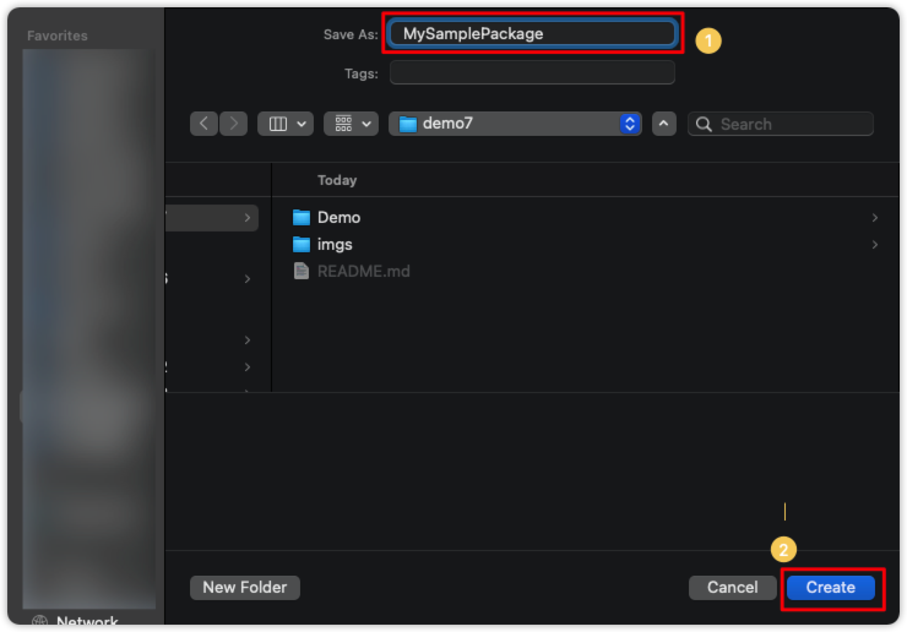
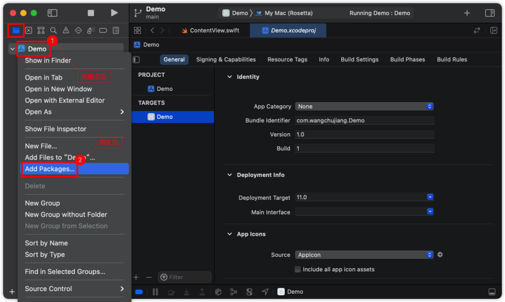
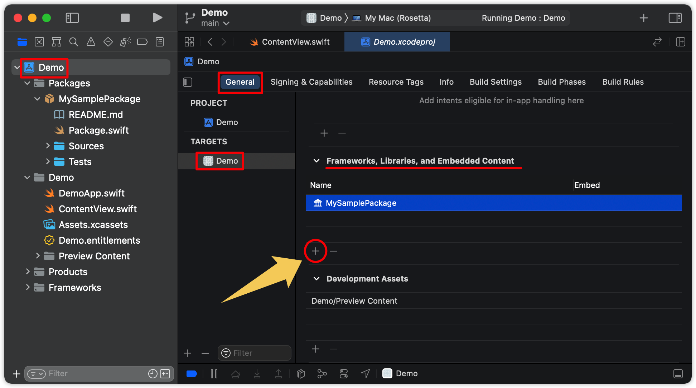
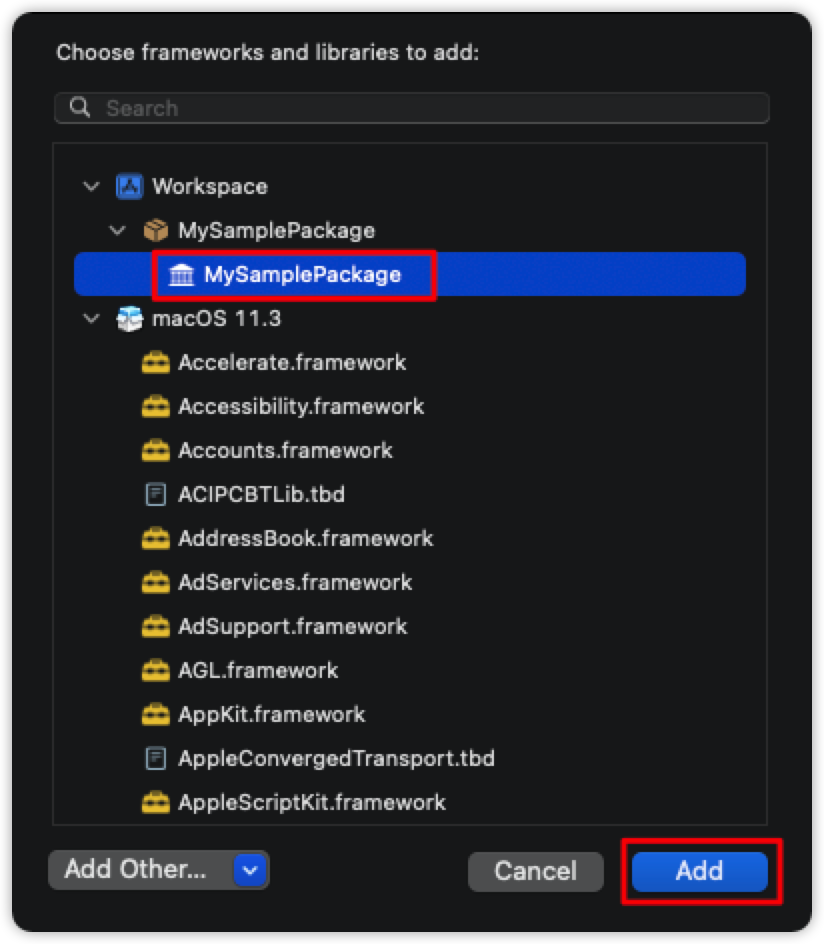
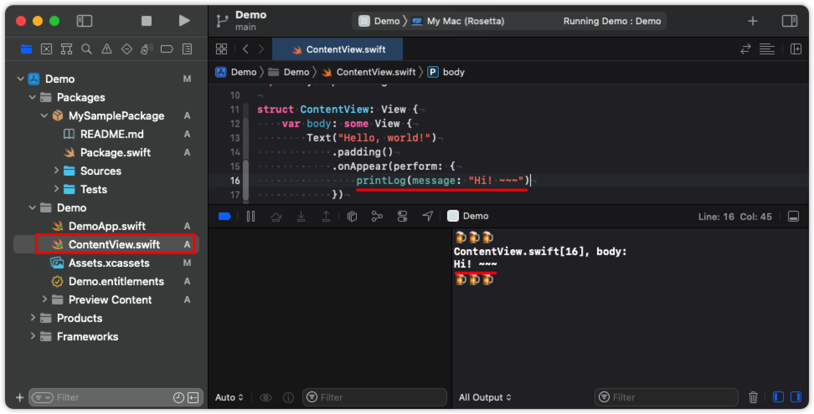

如何在 Xcode 中添加创建 Swift 包依赖？
===

到目前为止，我们一直在编码的所有东西都是我们从头开始构建的，因此您可以确切地看到它是如何工作的，并将这些技能应用到您自己的项目中。 但是，有时从头开始编写一些东西是有风险的：也许代码很复杂，也许很容易出错，也许经常更改，或者任何其他无数的原因，这就是存在依赖关系的原因——获取第三方代码的能力 并在我们的项目中使用它。

Xcode 内置了一个依赖管理器，称为 Swift Package Manager (SPM)。 你可以告诉 Xcode 一些在线存储的代码的 URL，它会为你下载它。 您甚至可以告诉它下载哪个版本，这意味着如果远程代码在未来某个时候发生变化，您可以确保它不会破坏您现有的代码。

为了尝试这个，我们使用 Xcode 创建一个 `MySamplePackage` 包，和一个 `Demo` 的工程。在 `Demo` 工程中使用 `MySamplePackage` 包进行本地开发调试。

## 创建 `MySamplePackage` 包

在 Xcode 菜单 `File` -> `New` -> `Packages...` 创建一个名为 `MySamplePackage` 的包。



在 `MySamplePackage/Sources/MySamplePackage/MySamplePackage.swift` 中添加一个测试方法。

```swift
public func printLog(message: Any, file: String = #file, method: String = #function, line: Int = #line) {
  #if DEBUG
    print("🍺🍺🍺\n\((file as NSString).lastPathComponent)[\(line)], \(method): \n\(message)\n🍺🍺🍺\n")
  #endif
}
```

> 🚧 注意：使用 <kbd>⌘</kbd> + <kbd>b</kbd> 编译。如果发现编译器报错，是因为测试代码有误。
<!--rehype:style=border-left: 8px solid #ffe564;background-color: #ffe56440;padding: 12px 16px;-->

## 添加 `MySamplePackage` 包

通过项目工程文件目录，点击右键 `Add packages...` 将本地报源文件添加到 `Demo` 工程中。



> 🚧 注意：在添加包之前，先关闭 `MySamplePackage` 包的工程
<!--rehype:style=border-left: 8px solid #ffe564;background-color: #ffe56440;padding: 12px 16px;-->

在新工程 `Demo` -> `TARGETS` -> `General` -> `Frameworks, Libraries, and Embedded Content` 中添加 `package`，如下图：



选择添加自定义的 `MySamplePackage` 包，如下图：


<!--rehype:width=320-->

## 添加测试代码

请打开 `ContentView.swift` 并将 `MySamplePackage` 包导入添加到顶部：

```swift
import MySamplePackage
```

调用自定义包 `MySamplePackage` 中的 `printLog` 方法进行测试

```swift
import SwiftUI
import MySamplePackage

struct ContentView: View {
    var body: some View {
        Text("Hello, world!")
            .padding()
            .onAppear(perform: {
                printLog(message: "Hi! ~~~")
            })
    }
}

struct ContentView_Previews: PreviewProvider {
    static var previews: some View {
        ContentView()
    }
}
```

