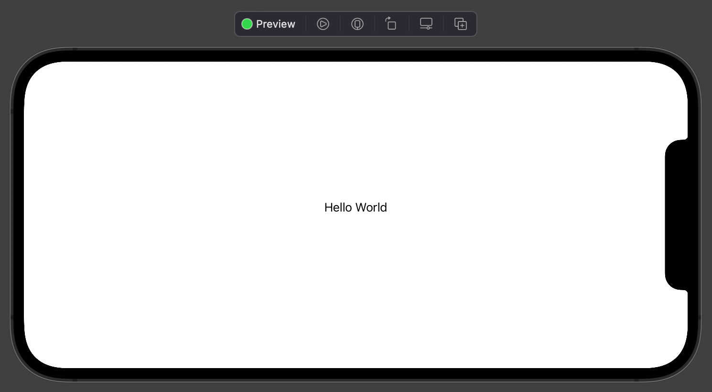
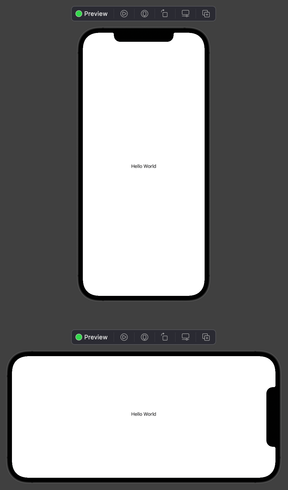

如何以纵向或横向预览布局？
===

`SwiftUI` 有一个专用的 `previewInterfaceOrientation()` 修饰符，用于控制设备预览在 `Xcode` 画布中的显示方式。 要使用它，请传递四个设备旋转选项之一：`.portrait`、`.portraitUpsideDown`、`.landscapeLeft` 或 `.landscapeRight`。

例如，这将显示横向左侧预览：

```swift
struct ContentView_Previews: PreviewProvider {
  static var previews: some View {
    ContentView()
      .previewInterfaceOrientation(.landscapeLeft)
  }
}
```

<!--rehype:style=max-width:650px-->

请记住，您的预览提供程序可以包含多个设备，并且它们会在另一个之上显示。 这意味着您可以同时显示纵向和横向：

```swift
struct ContentView_Previews: PreviewProvider {
  static var previews: some View {
    ContentView()

    ContentView()
      .previewInterfaceOrientation(.landscapeLeft)
  }
}
```

<!--rehype:style=max-width:650px-->