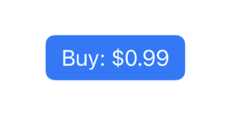
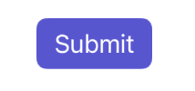

如何获得突出的边框按钮？
===


`SwiftUI` 具有专用的 `.bordered` 按钮样式，模仿了许多 `Apple` 应用程序中使用的常见外观和感觉。 在最基本的形式中，它看起来像这样：

```swift
Button("Buy: $0.99") {
    print("Buying…")
}
.buttonStyle(.bordered)
```


但是，对于应该在屏幕上真正突出的按钮，您可能希望使用 `borderedProminent` 选项使它们的颜色更浓：

```swift
Button("Buy: $0.99") {
    print("Buying for $0.99")
}
.buttonStyle(.borderedProminent)
```



重要提示：有很多突出的按钮并不是好的 UI 实践。

您可以使用 `tint()` 自定义这些按钮的颜色：

```swift
Button("Submit") {
    print("Submitting…")
}
.tint(.indigo)
.buttonStyle(.borderedProminent)
```



或者通过将角色附加到按钮：

```swift
Button("Delete", role: .destructive) {
    print("Deleting…")
}
.buttonStyle(.borderedProminent)
```

