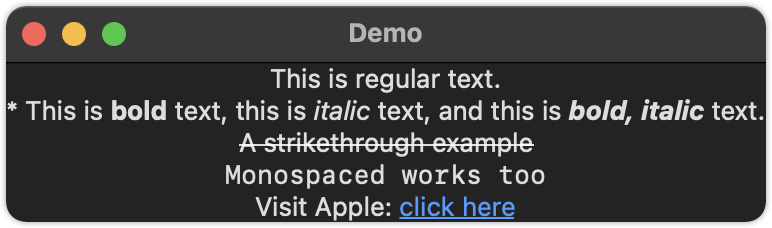

如何在文本中呈现 `Markdown` 内容？
===


SwiftUI 内置了对渲染 Markdown 的支持，包括粗体、斜体、链接等。它不需要做任何工作——它实际上是内置在 SwiftUI 的 Text 视图中的，所以你可以编写如下代码：

```swift
VStack {
  Text("This is regular text.")
  Text("* This is **bold** text, this is *italic* text, and this is ***bold, italic*** text.")
  Text("~~A strikethrough example~~")
  Text("`Monospaced works too`")
  Text("Visit Apple: [click here](https://apple.com)")
}
```

<!--rehype:style=max-width:386px-->

是的，该链接是自动可点击的。

注意：不支持图片，不支持其它 Markdown 语法。