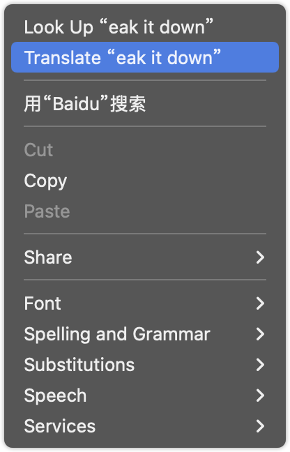
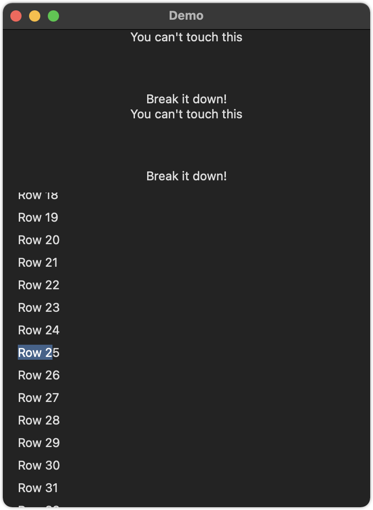

如何让用户选择文本？
===


Swift 的 Text 视图默认表示静态的、不可选择的文本，但您可以使用带有 `.enabled` 值的 `.textSelection()` 修饰符来更改它。

例如，这使得一些文本用户可以选择，而一些用户不能：

```swift
VStack(spacing: 50) {
  Text("You can't touch this")

  Text("Break it down!")
      .textSelection(.enabled)
}
```

<!--rehype:style=max-width:126px-->

<!--rehype:style=max-width:208px-->

选择文本后，用户会自动获得对常规文本操作的访问权限，例如复制和共享。 然而，现在至少整个文本区域都被复制了——你没有文本选择放大镜，所以你不能只选择几个单词。

在任何类型的视图组上设置 `textSelection()` 将自动使该组内的所有文本都可选择。 例如，我们可以通过将修饰符向上移动到堆栈来使前面示例中的两个文本视图都可选择：

```swift
VStack(spacing: 50) {
  Text("You can't touch this")
  Text("Break it down!")
}
.textSelection(.enabled)
```

您甚至可以将 `textSelection()` 应用于列表，在这种情况下，列表中的文本行变为可选择的：

```swift
List(0..<100) { index in
  Text("Row \(index)")
}
.textSelection(.enabled)
```

<!--rehype:style=max-width:380px-->

提示：您需要直接按住一行中的文本，而不是其他任何地方。